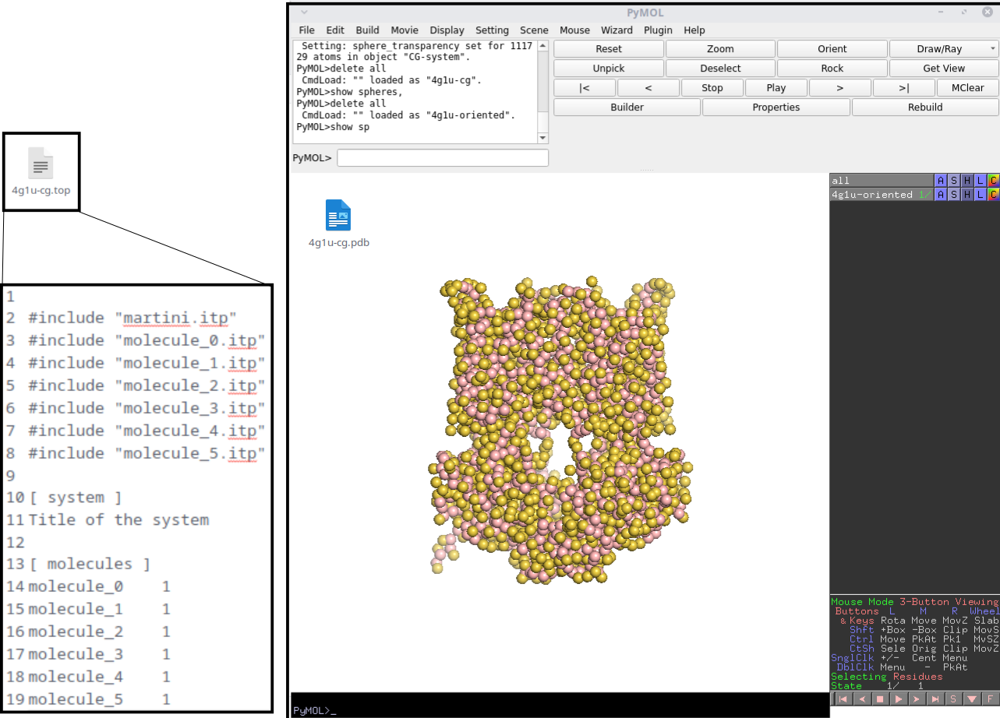
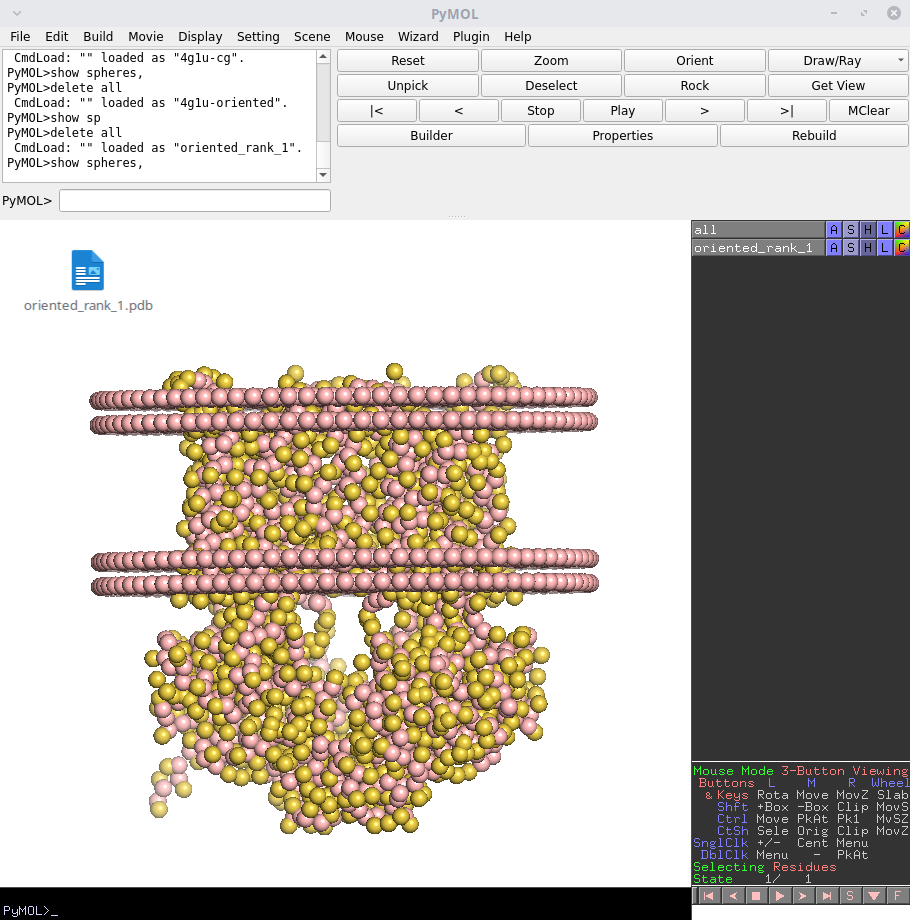
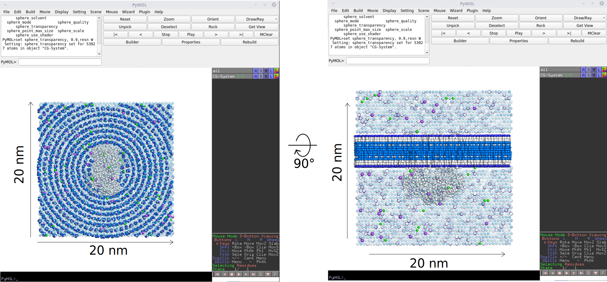
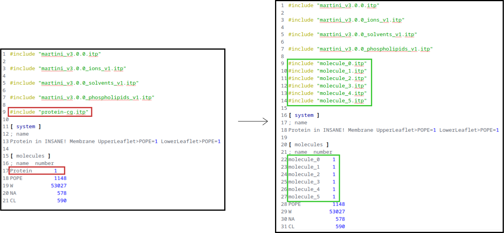
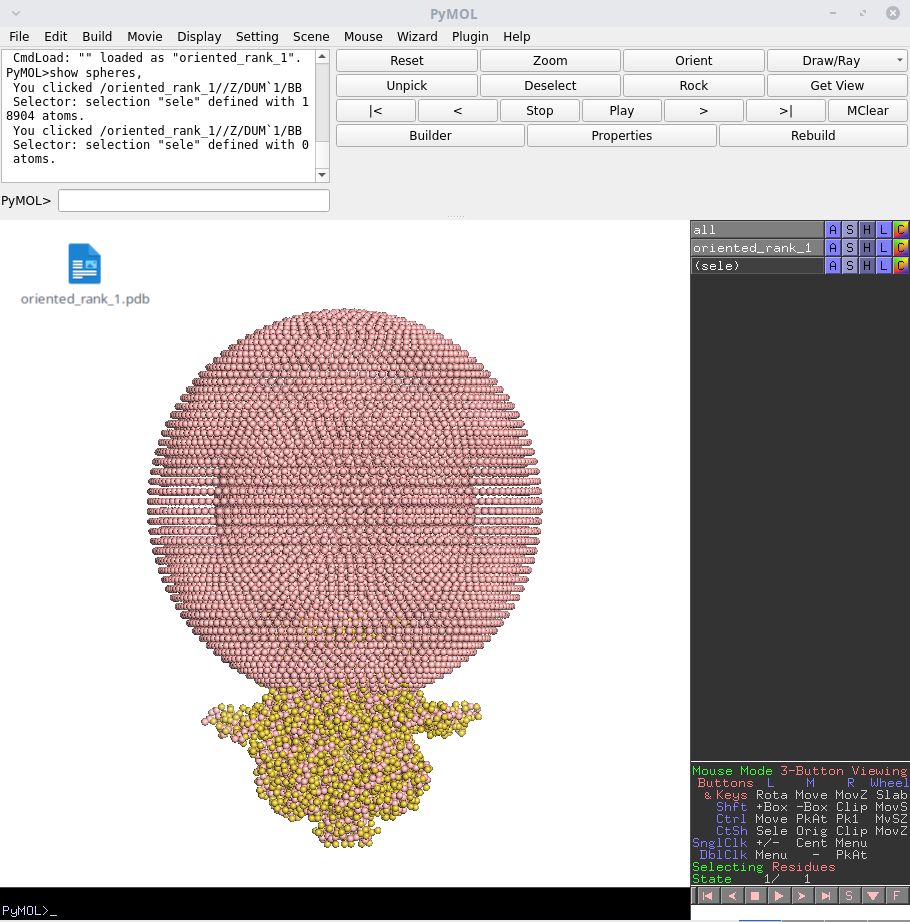
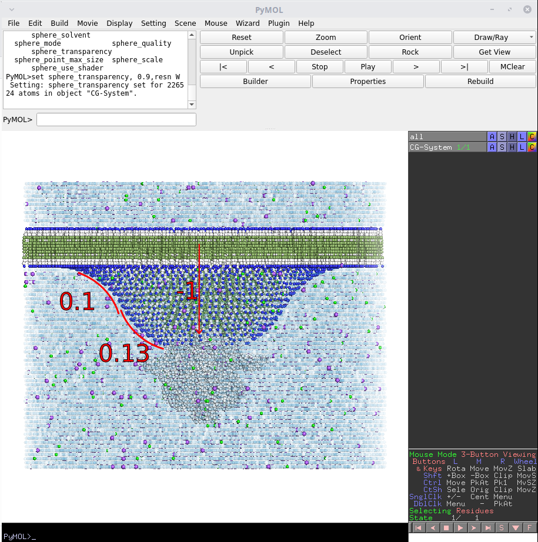
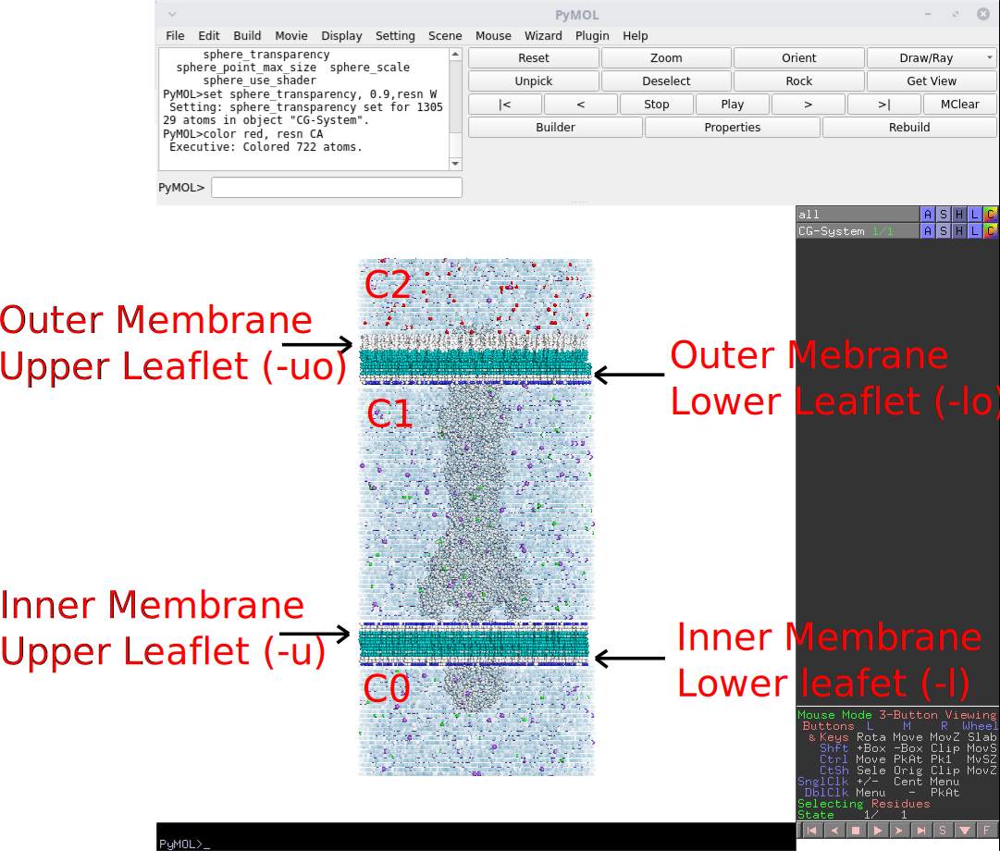
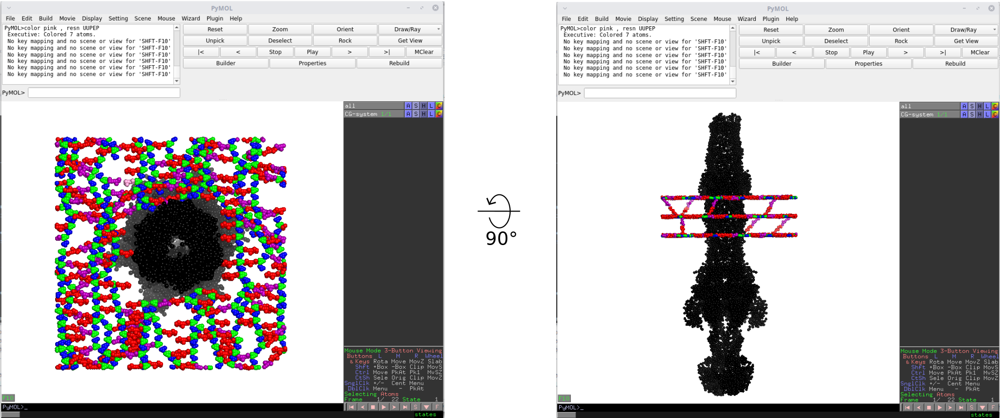
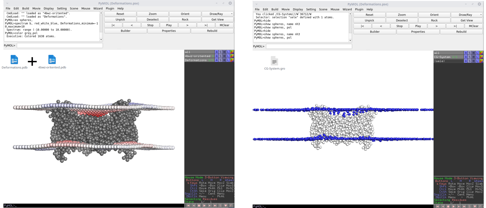

# Tutorials

Note that these tutorials assume a Linux OS, however as MemPrO is a python script it should also work on any other OS so long as you can run python. Additionally, PyMOL will be used as the molecular visualisation program throughout this tutorial, however VMD or any other such program can be used. It is recommended to have look at the [first MemPrO tutorial](MemPrO_tutorials.md#tutorial-1---a_basic_example) before looking at these.

## Tutorial 1 - A Basic Example

In this tutorial we will build a CG system with a simple POPE lipid bilayer with an integral membrane protein embedded within. For all of the following tutorials proteins will need to be in a coarse grained format. Each tutorial will have links/instructions for downloading an atomistic protein from the PDB, here we will quickly go over how to go about coarse graining these proteins. For this tutorial we will go over coarse graining the protein 4G1U, which we will be using to build the full CG system, to download this one can use the fetch command in PyMOL followed by saving as a .pdb, further details on this method can be found [here](https://pymolwiki.org/index.php/Fetch). Otherwise go to the [following page on the PDB website](https://www.rcsb.org/structure/4g1u) and download in PDB format. Create a folder called "Tutorial1" and place the downloaded file into it.

We will be using Martinize2 for coarse graining, for install instructions and usage refer to the [GitHub repo](https://github.com/marrink-lab/vermouth-martinize). Navigate to "Tutorial1" and run the following to CG 4g1u:
>martinize2 -f 4g1u.pdb -ff martini3001 -x 4g1u-cg.pdb -o 4g1u-cg.top -dssp PATH/TO/mkdssp -scfix -elastic -ef 500 -eu 0.9 -el 0.5 -ea 0 -ep 0 -merge A -maxwarn 1000

Provided this runs without errors several files will be generated. The first of these will be "4g1u-cg.pdb", which will be the coarse grained copy of 4g1u. One can look at this in PyMOL by first loading the file, then running "show spheres" to check everything has run correctly. Next we have "4g1u-cg.top" which contains the topology information for the coarse grained protein. We will need this when amending the topology files after the creation of the CG system. Finally, we have the ".itp" files, these will be used in the topolgy file later.

We now want to orient the protein so that it will be in the correct place when building the CG system. Note that we can build this system automatically after orientation using MemPrO, but as this tutorial is for the use of Insane4MemPrO we will not be doing this. To orient to protein run the following:

>python PATH/TO/MemPrO_Script.py -f 4g1u-cg.pdb -ng 16 -ni 150

For more details on the use of MemPrO refer to these [tutorials](MemPrO_tutorials.md#). Once the code has finished running look at the file "Oreint/Rank_1/oriented_rank_1.pdb" in PyMOL to check orientation has proceeded correctly. We will now create a copy of this without the dummy membrane by running to following:

>sed '/DUM/d' ./Orient/Rank_1/oriented_rank_1.pdb > 4g1u-oriented.pdb

We now run the following to create the full CG system:

>python PATH/TO/Insane4MemPrO.py -f 4g1u-oriented.pdb -p topol.top -o CG-System.gro -x 20 -y 20 -z 20 -sol W -l POPE -negi_c0 CL -posi_c0 NA

Here -p and -o indicate the name of the output files. "CG-System.gro" is the CG system as the name may suggest. "topol.top" is the topology file which will be need for running simulations. Load "CG-System.gro" in PyMOL. Make sure all sphere are visible by typing "show spheres", also type "show cell" to show the simulation cell. -x,-y and -z control the size of the system cell, here we inputted 20 nm, and we can verify this by looking at the bottom of "CG-System.gro". -sol defines the solvent used, in this case "W" indicates water. -l is used to define the composition of the bilayer, in this case we are just defining a membrane composed of only POPE. More detail on -l will be in following tutorials. -negi_c0 and -posi_c0 define the (NEG)ative (I)ons and (POS)itive (I)ons. In this case we are setting negative ions to be Cl- and positive ions to be Na+. These work in a similar way to -l and more detail will be in further tutorials. All this can be verified by looking at CG beads in the CG system using PyMOL.

There is one final step before we can begin simulating the CG system. Open "topol.top" and look at the \[molecules\] section. The first molecule is "Protein", this is a placeholder and will need to be replaced. Open "4g1u-cg.top", copy everything under \[molecules\] and replace the line containing "Protein" in "topol.top" with this. Additionally, replace "include protein-cg.top" with "include molecule_{n}.itp" where {n} is 0,1,2... for each .itp created during the coarse graining process. This process may be automated in future versions of Insane4MemPrO.

And we are ready for simulation! This is where will end each tutorial as there are already many good tutorials for running coarse grained molecular dynamics simulation, all I will say is remember to energy minimise!

## Tutorial 2 - Building a Curved System

In this tutorial we will build a curved membrane with a more complex lipid composition. We will be building a membrane made up of POPE and POPG, to be able to build using these lipids, they must be defined in Insane4MemPrO, this is identical to the original Insane. Additionally, to run simulations with these lipids they must be defined in itp files. As this tutorial is for using Insane4MemPrO I will not go over in detail how to add lipids to Insane4MemPrO or how to simulate. For help with this refer to ~this and this~.

We start as usual by downloading an appropriate protein from the PDB, in this case we will be downloading a mechanosensative ion channel with code 7N5E. To download this one can use the fetch commmand in PyMOL followed by saving as a .pdb, further details on this method can be found [here](https://pymolwiki.org/index.php/Fetch). Otherwise go to the [following page on the PDB website](https://www.rcsb.org/structure/7n5e) and download in PDB format. Create a folder called "Tutorial2" and place the downloaded file into it.

Next coarse grain the protein as in [Tutorial 1](#tutorial-1---a-basic-example) calling the output 7n5e-cg.pdb. Next we will need to orient the protein in a curved membrane. We can use MemPrO to do this, note that we can also automatically build using MemPrO. We will first build it ourselves after orientation and then build it automatically with MemPrO. 

Run the following to orient 7N5E in a curved membrane.
>python PATH/TO/MemPrO_Script.py -f 7n5e-cg.pdb -ng 16 -ni 150 -c

Looking at "Orient/orientation.txt" should show a clear rank 1. Looking at "Rank_1/info_rank_1.txt" we can see that a curvature of roughly -0.013 A^-1 is predicted, we will need to use this value to build the CG system. Follow the procedure in [Tutorial 1](#tutorial-1---a-basic-example) to make a copy of the oriented protein. To build the system run the following:

>python PATH/TO/Insane4MemPrO.py -f 7n5e-oriented.pdb -p topol.top -o CG-System.gro -x 20 -y 20 -z 30 -curv 0.13,0.1,-1 -sol W -l POPE:4 -l POPG:1 -negi_c0 CL -posi_c0 NA

Here we have made a few changes over tutorial 1. Firstly we have increased the size of the box in the z direction in order to contained the added height from the curved region. Secondly, we have added "-curv 0.13,0.1,-1". The first value, 0.13, is the absolute curvature in nm^-1 which we calculated with MemPrO, the second, 0.1, is the curvature of the membrane as it returns to planar and the final value, -1, is the sign of the curvature. The final change is to -l, we have changed "-l POPE" to "-l POPE:4 -l POPG:1". The numbers represent the relative abundance of the lipid before it, and the second -l simply adds a new lipid type. So "-l POPE:4 -l POPG:1" creates a membrane with POPE and POPG ina ratio of 4:1.

Looking at "CG-System.gro" in PyMOL we can see the simulation box is fairly large, this is needed to allow for the curvature to relax back to a planar membrane and to leave enough space between periodic images. The final step as before is to update the file "topol.top" as described in [Tutorial 1](#tutorial-1---a-basic-example).

As promised we will now look at how MemPrO can build this automatically.

>python PATH/TO/MemPrO_Script.py -f 7n5e-cg.pdb -o "Orient_build/" -ng 16 -ni 150 -c -bd 1 -bd_args "-sol W -l POPE:4 -l POPG:1 -negi_c0 CL -posi_c0 NA"

As you can see only some of the flags need to be added as MemPrO deals with all the structural elements of building the CG system. Looking in the folder "Orient_build/Rank_1/CG_System_rank_1/" we find both the CG system and the topology file, called "CG-system.gro" and "topol.top" respectively. "topol.top" will need to be modified as always. The system is now ready for energy minimisation and simulation.

## Tutorial 3 - Double membrane systems

In MemPrO [tutorial 5](MemPrO_tutorials.md#tutorial-5---building-cg-systems-from-orientations) we look at building a double membrane CG system automatically using MemPrO. We will revisit this system in this tutorial. We will be building a more complex version of this system, controlling the ions present in each compartmenet, and the lipid composition of the inner and outer membranes. As before we will look at how to build this system manually, and also automatically using MemPrO. Make a new folder called "Tutorial3" and if you have already done [tutorial 5](MemPrO_tutorials.md#tutorial-5---building-cg-systems-from-orientations) then simply copy over "5nik-cg.pdb" or follow the download instructions in [tutorial 2](MemPrO_tutorials.md#tutorial-2---double-membrane-systems).

We start with orienting the protein
>python PATH/TO/MemPrO_Script.py -f 5nik-cg.pdb -ng 16 -ni 150 -dm

As in [tutorial 1](#tutorial-1---a-basic-example) create a copy without the dummy membrane called "5nik-oriented.pdb". Next we will need to look at "Orient/Rank_1/info_rank_1.txt" to find the inter membrane distance, which should be around 272 angstroms. We can now build the CG system with the following command:
>python PATH/TO/Insane4MemPrO.py -f 5nik-oriented.pdb -p topol.top -o CG-System.gro -x 20 -y 20 -z 50 -ps 13.6 -sol W -l POPE:8 -l POPG:1 -l CARD:1 -uo LIPA -negi_c0 CL -posi_c0 NA -negi_c2 CL -posi_c2 NA:1 -posi_c2 CA:4 -auo 1.8

This command may look complicated but it is actually rather simple. First we have added "-ps 13.6", which tells the code to build two membrane which are at + and - 13.6 nm which corresponds to the intermembrane distance calculated by MemPrO. Next we have added "-uo LIPA" this flag does a similar job as "-l", but it specifies that the (u)pper leaflet of the (o)uter membrane should be composed entirely of LIPA (The code for this may be different depending on what is defined in your copy of Insane4MemPrO). We also have the flag "-auo 1.8" which tells the code that the (a)rea per lipid in the (u)pper leaflet of the (o)uter membrane should be 1.8. Finally we have "-negi_c2 CL" , "-posi_c2 NA:1" and "-posi_c2 CA:4". Before we get into what these flags are doing I will give a quick explaination of disjoint water compartments. 

Each membrane in a system is a barrier to water, when only one membrane is present this doesn't cause any issues as a water/ion bead may leave from the bottom of a cell and reappear at the top, hence every water/ion bead can move to any position in the cell. If we introduce a second membrane then water/ion beads between the two membranes can never move out from between the membranes, hence two distinct comparments of solution are created. If we don't have z periodicity then even more disjoint compartments are created.

Returning to the flags "-negi_c2 CL" , "-posi_c2 NA:1" and "-posi_c2 CA:4" we are telling the code that the compartment labeled "c2" should contain negative ions Cl- and posative ions Ca+2 and Na+ in the ratio 4:1. There are 3 possible compartments "c0, c1, and c2". 

Loading "CG-System.gro" we can inspect the CG system and check everything is as it should be. Before simulation remeber to update the topology file "topol.top"

We can also build this automatically with MemPrO by running the following command:
>python PATH/TO/MemPrO_Script.py -f 5nik-cg.pdb -o "Orient_build/" -ng 16 -ni 150 -dm -bd 1 -bd_args "-sol W -l POPE:8 -l POPG:1 -l CARD:1 -uo LIPA -negi_c0 CL -posi_c0 NA -negi_c2 CL -posi_c2 NA:1 -posi_c2 CA:4 -auo 1.8"

As before MemPrO deals with the double membrane, and we need only worry about defining the composition of the system. Looking in the folder "Orient_build/Rank_1/CG_System_rank_1/" we find both the CG system and the topology file, called "CG-system.gro" and "topol.top" respectively. "topol.top" will need to be modified as always. The system is now ready for energy minimisation and simulation. In this case it is recommended to use position restrains during equilibration to allow water to fill out the inside of the protein correctly.

## Tutorial 4 - Building with peptidoglycan layers

In tutorial 3 we looked at building a more accurate double membrane system. We can however still improve on the accuracy of this system by adding a peptidoglycan (PG) cell wall. In this tutorial we will build a system much like before but this time we will include the PG cell wall. Make a new folder called "Tutorial4" and if you have already done [tutorial 5](MemPrO_tutorials.md#tutorial-5---building-cg-systems-from-orientations) then simply copy over "5nik-cg.pdb" or follow the download instructions in [tutorial 2](MemPrO_tutorials.md#tutorial-2---double-membrane-systems). We will also need the following files "NAM.itp", "NAG.itp", "SNPEP.itp", "UNPEP.itp" and "UUNPEP.itp". These are the components used to build the PG layer, and can be found in the folder "PG_Components".

As always we start by orienting the protein.
>python PATH/TO/MemPrO_Script.py -f 5nik-cg.pdb -ng 16 -ni 150 -dm -pg

As in [tutorial 1](#tutorial-1---a-basic-example) create a copy without the dummy membrane called "5nik-oriented.pdb". Next we will need to look at "Orient/Rank_1/info_rank_1.txt" to find the inter membrane distance and the position of the PG layer, which should be around 272 and "" angstroms respectively. We can now build the CG system with the following command:
>python PATH/TO/Insane4MemPrO.py -f 5nik-oriented.pdb -p topol.top -o CG-System.gro -x 20 -y 20 -z 50 -ps 13.6 -sol W -l POPE:8 -l POPG:1 -l CARD:1 -uo LIPA -negi_c0 CL -posi_c0 NA -negi_c2 CL -posi_c2 NA:1 -posi_c2 CA:4 -auo 1.8 -pgl 3 -pgl_z "" -oper 0 -lper 0.2

Here we have a few more flags to go through. The first of these "-pgl" specifies the number of PG layers to add, in this case we are adding 3 layers. The next is "-pgl_z" which indicates the position at which to place the PG layer. The position is specified as the distance from the centre and we can find this information from the MemPrO prediction. The next flags "-oper" and "-lper" control the fine detail of the layer. There are many such flags which are explained in detail [here](README.md#peptidoglycan-layer-related-options). 

This command will output additionally a file called "PGL.itp". This is an itp file containing the bond and angle information for the whole PG layer. Looking at "CG-System.gro" we should see a PG layer has been added at the location predicted by MemPrO.

As with all tutorials above we can also build this automatically with MemPrO using the following.
>python PATH/TO/MemPrO_Script.py -f 5nik-cg.pdb -o "Orient_build/" -ng 16 -ni 150 -dm -bd 1 -pg -pg_guess 75 -bd_args "-sol W -l POPE:8 -l POPG:1 -l CARD:1 -uo LIPA -negi_c0 CL -posi_c0 NA -negi_c2 CL -posi_c2 NA:1 -posi_c2 CA:4 -auo 1.8 -pgl 3 -oper 0 -lper 0.2"

We no longer need to specifiy the Z position of the PG layer with "-pgl_z" as MemPrO deals with this as with all such structural information. Looking in the folder "Orient_build/Rank_1/CG_System_rank_1/" we find both the CG system and the topology file, called "CG-system.gro" and "topol.top" respectively. "topol.top" will need to be modified as always. The system is now ready for energy minimisation and simulation. As with the above it is recommended to use position restrains during equilibration to allow water to fill out the inside of the protein correctly.

## Tutorial 5 - Building with Deformations

In this tutorial we will look at how to use Insane4MemPrO to build deformation predictions from MemPrOD. If you haven't used MemPrOD before I recommend looking at the [MemPrOD GitHub](https://github.com/ShufflerBardOnTheEdge/MemPrOD). We begin as always by creating a new folder called "Tutorial5". We will be using the protein 4BWZ which can be downloaded from [here](https://memprotmd.bioch.ox.ac.uk/_ref/PDB/4bwz/_sim/4bwz_default_dppc/), download "4bwz_default_dppc-head-contacts.pdb" and rename this to "4bwz.pdb". Put "4bwz.pdb" into "Tutorial5". 

We will as before use martinize2 to coarse grain the protein. Refer to [Tutorial 1 - A Basic Example](https://github.com/ShufflerBardOnTheEdge/MemPrO/blob/main/Insane4MemPrO_tutorials.md#tutorial-1---a-basic-example) if you are unsure how to do this. We should not have a coarse grained copy of 4BWZ called "4bwz-cg.pdb". We will now run MemPrO to orient the protein with the following command:

>python PATH/TO/MemPrO_Script.py -f 4bwz-cg.pdb

We will now create a file "4bwz-oriented.pdb" containing the oriented protein without the dummy membrane - Again refer to [Tutorial 1 - A Basic Example](https://github.com/ShufflerBardOnTheEdge/MemPrO/blob/main/Insane4MemPrO_tutorials.md#tutorial-1---a-basic-example) if you are unsure.

Next we will predict the deformations using MemPrOD. Instructions for installation and use of MemPrOD can be found [here](https://github.com/ShufflerBardOnTheEdge/MemPrOD). Run the following command

>python PATH/TO/MemPrOD.py -f 4bwz-oriented.pdb

This will take around 100s to run. A folder called Deformations will be create in which we will find several files and folders. We are only interested in "Deformations.pdb" and "Membrane_Data/". We can look at "Deformations.pdb" and "4bwz-oriented.pdb" together to see what the deformation prediction looks like. We are now ready to build a CG system with deformations. We run the following command:

>python PATH/TO/Insane4MemPrO.py -f 4bwz-oriented.pdb -p topol.top -o CG-System.gro -x 20 -y 20 -z 20 -sol W -l POPE -negi_c0 CL -posi_c0 NA -def Deformations/Membrane_Data/

The only difference between the usual command is the -def flag, this tells Insane4MemPrO where all the deformation information is stored, which in our case is Deformations/Membrane_Data/. We can now look at "CG-system.gro" in PyMOL, run the following set of commands to see the deformation more clearly

>hide

>show spheres,name nh3

>show spheres,pol

Hopefully now you should be able to see how the NH3 beads in the POPE lipid are deformed in the same way as predicted by MemPrOD. This system can now be energy minimised and equilibrated as usual.

## Final comments

Hopefully now you feel confident in using Insane4MemPrO to build complex systems with and without the use of MemPrO to automatically apply any structural elements. There are some more advanced features of Insane4MemPrO that were not covered in these tutorials. More tutorials on these advanced topics may become available in the future. For now if you run into any problems/bugs please let me know at m.parrag@warwick.ac.uk and I will do my best to help.

