# Tutorials

Note that these tutorials assume a Linux OS, however as MemPrO is a python script it should also work on any other OS so long as you can run python. Additionally, PyMOL will be used as the molecular visualisation programm throughout this tutorial, however VMD or any other such program can be used.

## Tutorial 1 - A Basic Example

This first tutorial will run through how to use MemPrO for the most basic use-case, the orientation of a integral membrane protein in a planar membrane. The first step will be to download an exmaple integral membrane protein, let us choose 4G1U from the protein data bank. To download this one can use the fetch commmand in PyMOL followed by saving as a .pdb, further details on this method can be found [here](https://pymolwiki.org/index.php/Fetch). Otherwise go to the [following page on the PDB website](https://www.rcsb.org/structure/4g1u) and download in PDB format.

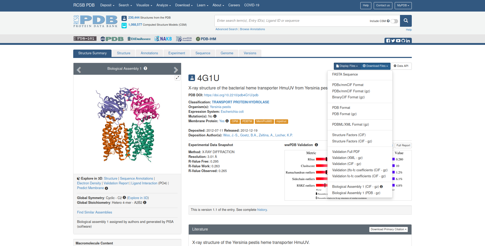

Now create a folder called "Tutorial1" to contain all the files for this tutorial, and place the downloaded pdb file in there. This structure will include some ligands, these can either be removed or, as it does not affect orientation, ignored. Now in a terminal navigate to the folder you just created.

We will now run MemPrO:

>python PATH/TO/MemPrO_Script.py -f 4g1u.pdb -ng 16 -ni 150

Here we are using an initial grid of 16 starting configurations (The higher to better, though 16 is more than enough), and 150 minimisation iterations (Again the higher the better, but 150 is more than enough). 

Once the code has finished running, which with ~16 CPUs should take about 90 seconds, you should find a folder called "Orient" in the Tutorial1 folder. Opening this folder you should find several files and folders. First we will look at orientations.txt, in here we will find all the orientations found by MemPrO. MemPrO can be a little random so your results may differ from what is shown here, but it should be very similar. 

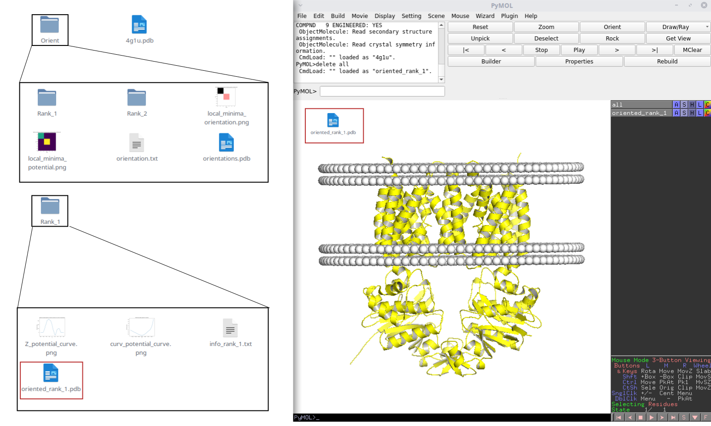

In my case MemPrO found two possible orientations. Each orientation has 6 numbers associated with it. The first is its rank. Let us look at the rank 1 orientation. 

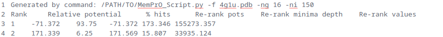

The second number represents the relative potential of the orientation, where 0 would be a protein fully in solvent. So here we can see that rank 1 orientation has lower potential than if the protein were not in the membrane which is a good sign. The third number is the percent of configurations that minimised to this particular orientation, a value of 93.75% indicates a high confidence, though a low value doesn't always mean low confidence. The fourth number should be very close to the second but otherwise can be ignored. The fifth number indicates the calculated depth of the minima, the higher the more stable the orientation is. The sixth and final number is a value calculated from the other values shown by which the orientations are ranked, this value can only be used to compare orientations from the same run of MemPrO.

Knowing now what these numbers mean hopefully one can see, in this case, the rank 1 orientation is a very stable and deep minima, while any others are very much not. We can now look at orientations.pdb.

orientations.pdb contains all orientations in a single file, ordered by their rank. Looking at each orientation in turn hopefully one can verify that the rank 1 orientation look sensible while the others are indeed more questionable. MemPrO outputs all minima found no matter how bad to provide as much information as possible.

One should be able to a folder for each rank within the Orient folder. Let us look in the folder "Rank_1". In this folder we should find info_rank_1.txt which contains some additional information on the orientation, two images, and the oriented protein PDB file which contains a dummy membrane for visualisation.

The first of the images Z_potential_curve.png shows the potential as the protein moves through the membrane. One should see a clear minima at around 20 angstroms with large peaks either side. This graph also shows this orientation is stable. In cases where orientation is more difficult this graph can be very helpful in identifying problems. The second image curv_potential_curve.png shows potential as curvature is varied. A curved membrane is only predicted when the flag -c is used, however this graph will always be calculated, in this case we can see the minima is around 0 curvature, so we can be confident that a planar membrane is indeed sufficient for orientation. We will see cases later where this graph will indicate the need for the use of curvature orientation.

Hopefully, one can see that MemPrO is very easy to use and also provides lots of information about the orientation. The next few tutorials will focus on a few of the more advanced features.

## Tutorial 2 - Double membrane systems
We will now look at the double membrane orientation in MemPrO. We will need to download a double membrane protein PDB, let us choose 5NIK from the protein data bank. To download this one can use the fetch command in PyMOL followed by saving as a .pdb, further details on this method can be found [here](https://pymolwiki.org/index.php/Fetch). Otherwise go to the [following page on the PDB website](https://www.rcsb.org/structure/5nik) and download in PDB format.

Now create a folder called "Tutorial2" to contain all the files for this tutorial, and place the downloaded pdb file in there as before. Now in a terminal navigate to the folder you just created and run the following:
>python PATH/TO/MemPrO_Script.py -f 5nik.pdb -ng 16 -ni 150 -dm

The only difference here is the addition of the flag -dm, this tells MemPrO to used two membranes for the orientation of this protein.

Once the code has finished running, which with ~16 CPUs should take about 140 seconds, you should find a folder called "Orient" in the Tutorial2 folder. The structure of the Orient folder is very similar to previously. We will look at a few differences. The ranking method is different in the case of double membrane proteins which is reflected in "oreintations.txt" in which the final 3 values for each rank should be 0. Double membranes are ranked on relative potential only due to the different nature of such orientations.

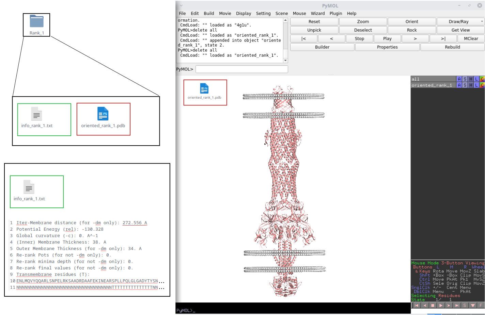

Within "Rank_1" we no longer see the two images, but we still have "info_rank_1.txt" and "oriented_rank_1.pdb". Looking at "info_rank_1.txt" we find on the first line "Inter-Membrane distance" with the value 272.556 angstroms indicating the distance between the inner and outer membranes.

## Tutorial 3 - Predicting the PG layer

5NIK is a periplasm spanning protein so the peptidoglycan (PG) layer would reside within the inner and outer membranes. We can use MemPrO to predict the placement of this. First copy 5nik.pdb across to a new folder called "Tutorial3" and run the following in a terminal in Tutorial3
>python PATH/TO/MemPrO_Script.py -f 5nik.pdb -ng 16 -ni 150 -dm -pg

As before after the code has finished running (Which should take 150 seconds with 16 CPUs) we will find the "Orient" folder.

In the folder "Orient/Rank_1" we will now find two graphs. We will focus only on "PG_potential_curve.png". This graph shows the potential associated with placing the PG layer at that position. One should be able to see the potential is lowest around 0-30 angstroms from the centre. In this region there are two minima that are reasonable deep at around ~10 and ~30 angstroms. The first of these is at the lowest potential and is added to "oriented_rank_1.pdb" as another set of dummy beads. The second is also a valid placement, as external factors can have an effect on the placement which may easily tip the balance between the two minima. In "info_rank_1.txt" we will find the exact position and the cross-sectional area of the protein at that positions alongside the other information.

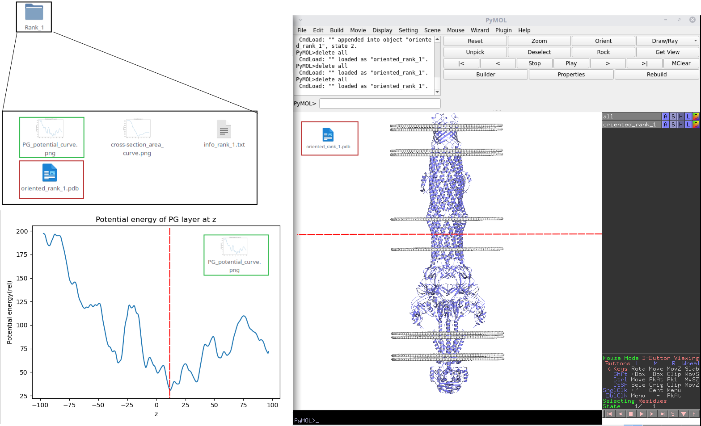

If additional information is known about where the PG layer may be, such as the length of LPP in the particular bacteria, then -pg_guess can be used to bias the potential. The value of pg_guess is the distance from the outer membrane to the PG layer. For E-coli LPP is about 75 angstroms long (corresponding to 30 A from the centre which was our second minima) so we can run the following

>python PATH/TO/MemPrO_Script.py -f 5nik.pdb -ng 16 -ni 150 -dm -pg -pg_guess 75 -o "Orient_PG_Guess/"

This will output to a folder called "Orient_PG_Guess" as specified by the -o flag. 

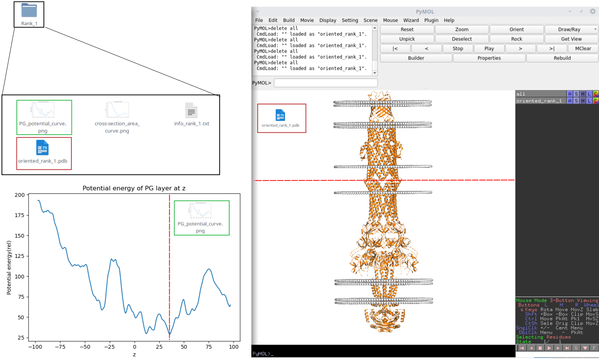

Looking at the file "Rank_1/oriented_rank_1.pdb" in Orient_PG_Guess, we should now see the PG layer placed higher up the protein.

## Tutorial 4 - Global curvature predictions

We will now move onto predicting global curvature of proteins.  We will need to download a PDB file for a protein that causes membrane curvature, let us choose 6BPZ from the protein data bank. To download this one can use the fetch command in PyMOL followed by saving as a .pdb, further details on this method can be found [here](https://pymolwiki.org/index.php/Fetch). Otherwise go to the [following page on the PDB website](https://www.rcsb.org/structure/6bpz) and download in PDB format.

As before let us make a folder called "Tutorial4" and place 6bpz.pdb in this folder. We will start by running a standard orientation to illustrate why global curvature predictions are sometimes needed.

>python PATH/TO/MemPrO_Script.py -f 6bpz.pdb -ng 16 -ni 150 -o "Orient_NoCurv/"

Looking in the folder "Orient_NoCurv" we find there are many more ranks than in previous examples. Let us look at "orientations.txt" and "orientations.pdb" to investigate. We see from orientations.txt none of the orientations have a negative potential, which doesn't necessarily mean there is an issue but can be indicative of an orientation where something is not quite right. We find that of the many ranks the first few have a final value much higher than the others. In my case these are around ~280000 with the others < 80000. Looking at the orientations in orientations.pdb we see for these the transmembrane regions are placed roughly within the membrane but there is a lot of variance in the position. This indicates either a highly mobile orientation or a unstable orientation. 

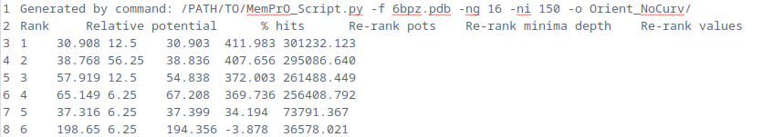

Let us now look in the folder "Rank_1". Looking at "Z_potential_curve.png" we see a extremely deep minima suggesting the orientation is perhaps not mobile (In Z at least), looking at "curv_potential_curve.png" reveals the issue. We find this graph shows a minima at -0.005 meaning a fairly significant negative curvature has lower potential than a planar membrane. Let us now run the following to include global curvature prediction

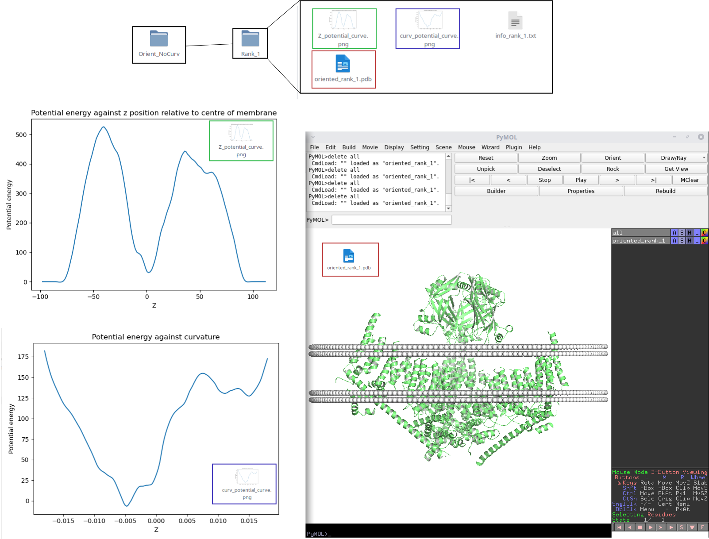

>python PATH/TO/MemPrO_Script.py -f 6bpz.pdb -ng 16 -ni 150 -o "Orient_Curv/" -c

Looking now in the folder "Orient_Curv" we can immediately see we have fewer final orientations. Looking in "orientations.txt" shows only one orientation with negative potential and a deep minima. This indicates a much more stable prediction. Looking at "oriented_rank_1.pdb" from the folder we can see the protein has been placed in a highly curved membrane. Looking at "curv_potential_curve.png" we can see the minima has actually shifted even further, this is because without curvature prediction there is a much greater error on the placement which affects the curvature calculations.

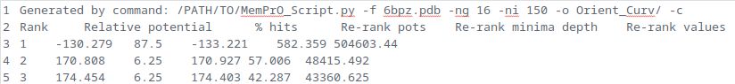

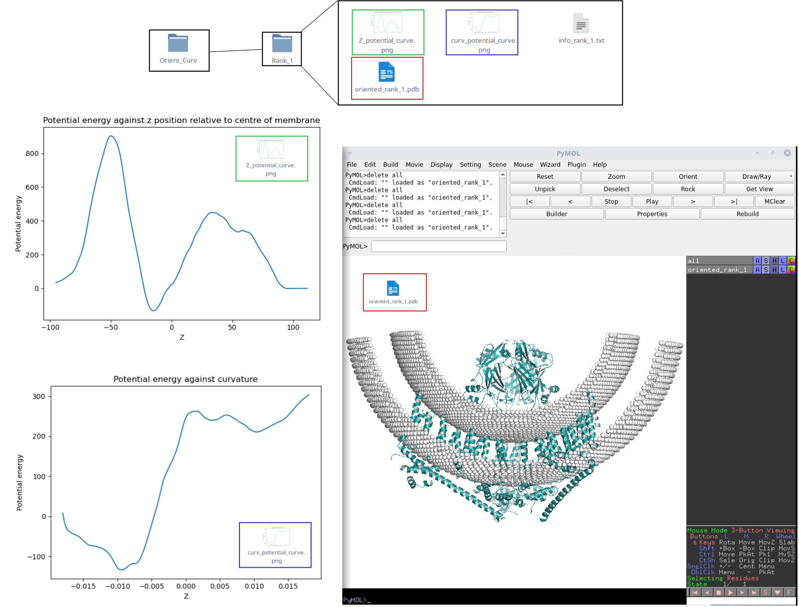

It is not always possible to see if a membrane should be curved by looking at "curv_potential_curve.png" in a planar orientation, but in many cases it may give an indication if the protein prefers curved environments.

## Tutorial 5 - Building CG systems from orientations

In this tutorial we will used MemPrO to orient 5NIK and automatically build a CG system. For the purpose of this tutorial both membranes will be made up of POPG and POPE even though this is not biologically accurate. Further tutorials for use of Insane4MemPrO are available [here](Insane4MemPrO_tutorials.md). We will start as always by making a folder called "Tutorial5" and then copy across 5nik.pdb or dowload as in [Double membrane systems](#tutorial-2---double-membrane-systems).

To build a CG system 5nik must first be coarse grained. For this we will use Martinize2, for install instructions and usage refer to the [GitHub repo](https://github.com/marrink-lab/vermouth-martinize). 

We will run the following to CG 5nik
>martinize2 -f 5nik.pdb -ff martini3001 -x 5nik-cg.pdb -o 5nik-cg.top -dssp PATH/TO/mkdssp -scfix -elastic -ef 500 -eu 0.9 -el 0.5 -ea 0 -ep 0 -merge A -maxwarn 1000

The details of this are not important for the purpose of this tutorial. For running CG simulations from the CG system build by MemPrO these values will need to be correct for the kind of simulation you wish to run.

Once we have the file 5nik-cg.pdb we can run the following
>python PATH/TO/MemPrO_Script.py -f 5nik-cg.pdb -ng 16 -ni 150 -dm -bd 1 -bd_args "-l POPE:8 -l POPG:2 -sol W -negi_c0 CL -posi_c0 NA" 

The flag -bd indicates we want to build a CG system for the top n (in this case n=1) ranks. The flag -bg_args is a string of additional arguments to pass to Insane4MemPrO. MemPrO will handle naming of all output files, the type of system to build (In this case a double membrane system) and the cell size for the simulation. Everthing else msut be put in the string of additional arguments. Here -l is used to indicate the lipid type and relative abundance (In this case POPE and POPG in the ration 8:2) in the lower leaflet of the inner membrane which with -u,-uo,-lo is used for all leaflets in all membranes, -negi_c0 and -posi_c0 are used to indicate the ions used to neutralise the system (In this case CL and NA ie salt) and -sol is used to indicate the solvent (In this case water). For a more detailed explaintion of all the flags and some detailed tutorials refer to [Insane4MemPrO documentation](README.md#insane4mempro).

Looking in the folder "Orient" we should see the now familiar set of files produced by MemPrO. Looking at "orientations.txt" and "orientations.pdb" we can satisfy ourselves that orientation has gone well and the rank 1 orienation looks sensible. Now looking in "Rank_1" we see an additional folder "CG_System_rank_1". This folder will contain 3 files "CG_system.gro", "protein-cg.pdb" and "topol.top". "topol.top" is a basic topology files for the system which may need minor editing, but will contain all the correct numbers of each molecule. "protein-cg.top" is a copy of the oriented protein without any dummy membranes present, and "CG_system.gro" is the full CG system build according to the build arguments passed to MemPrO.

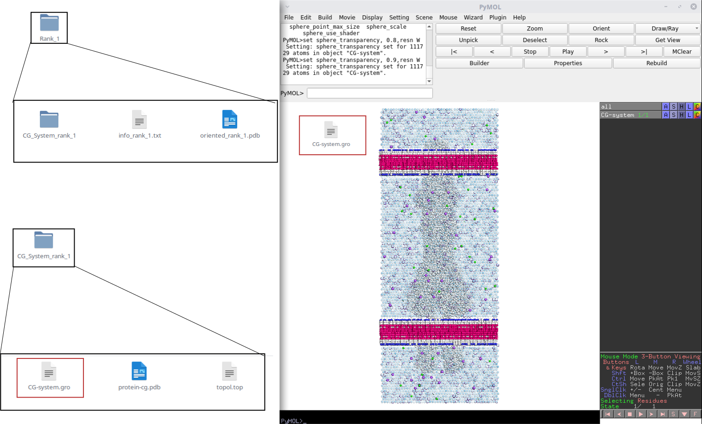

These files can be used together with the output from martinize2/the appropriate files describing the CG protein to run simulation.

## Tutorial 6 - Orienting Protein-Lipid complexes

In this tutorial we will be orienting a simple protein-lipid complex. For this we will need to first create a protein lipid complex to orient. Follow [Insane4MemPrO - Tutorial 1](https://github.com/ShufflerBardOnTheEdge/MemPrO/blob/main/Insane4MemPrO_tutorials.md#tutorial-1---a-basic-example) to generate a CG system with POPE and the protein 4G1U.

Create a new folder called "Tutorial6" and copy the final CG system across from Insane4MemPrO tutorial 1, for more interesting results you may energy minimise the system before continuing. To create a protein-lipid complex first load "CG-System.gro" in PyMOL, then hide all by the protein and lipids, with the following commands
>hide

>show spheres,pol

>show spheres,resn POPE

Now select a few of the lipids around the protein by clicking on each one you wish to add, then run the following command
>save 4G1U_Lipid.pdb,pol or sele

This will create a file called "4G1U_Lipid.pdb" which will be our protein-lipid complex. Make sure PyMOL is in the correct directory when you save the file! We can now orient this protein-lipid compelex using the following command

>python PATH/TO/MemPrO_Script.py -f 4G1U_Lipid.pdb -res POPE -res_itp PATH/TO/martini_v3.0.0_phospholipids_v1.itp -ng 16 -ni 150

Martini3 should come with "martini_v3.0.0_phospholipids_v1.itp", but in case you don't have this file any itp the describes a martini3 coarse grained POPE will work. Once the code has finished running we can have a look at "Orient/Rank_1/oriented_rank_1.pdb" to see if it has oriented correctly which, hopefully, it has.

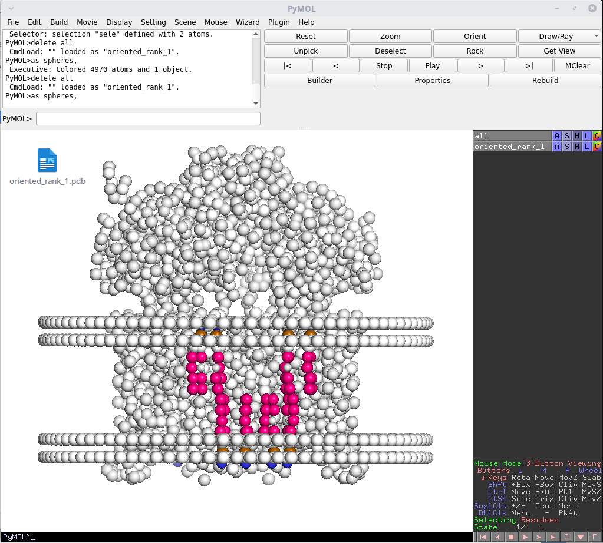

For an atomistic input the flag -res_cg will also need to be used. This will take a folder which contains files called RES.pdb where RES is replaced by the residues you are adding. For example in this case the folder would contain 1 file called "POPE.pdb". "RES.pdb" should contain the beading informations. The format for "RES.pdb" is based on CG2AT, an example for POPE can be found on the CG2AT GitHub Repo [here](https://github.com/owenvickery/cg2at/tree/master/database/fragments/martini_3-0_slipids/non_protein/POPE)

## Final comments

Hopefully with the above 6 tutorials you should now be set for using MemPrO to orient proteins and build CG systems ready for simulations. MemPrO has a few more advanced features and may in future have even more which are not covered by the tutorials, some advanced tutorials for these may become available in the future. For now if you run into difficulties or find errors please let me know by emailing m.parrag@warwick.ac.uk and I'll do my best to help.

