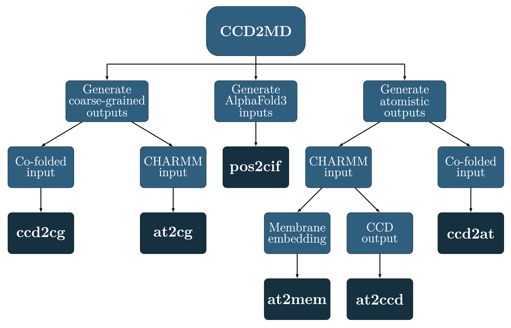

# CCD2MD codes for conversion between cofolding outputs and simulations

> **Citation:** Blow KE, Parrag M, Stansfeld PJ. *CCD2MD: A suite of packages for preparing co-folded outputs for molecular dynamics simulations.* J Chem Inf Model. 2025;65(22):12145–12154. [doi:10.1021/acs.jcim.5c02066](https://doi.org/10.1021/acs.jcim.5c02066)

  

CCD2MD contains several codes for the purpose of increasing the ease of cofolding outputs and simulations.
CCD2MD can be installed via pip (for versions 1.0.0 and above) via
>pip install CCD2MD
or to install all optional dependencies
>pip install "CCD2MD[membrane]"

The paper associated with this code can be found on JCIM [here](https://doi.org/10.1021/acs.jcim.5c02066). Please note that there have been updates to the code (documented below) since the release of the paper.

For full functionality, including membrane embedding please run ``pip install "CCD2MD[all]"``. Please note that this will not install gromacs, which is required for cg2at-lite/atomistic membrane embedding and all MD information.

This utilises the following packages:
**MemPrO/MemPrOD**
> **Citation:** Parrag M, Stansfeld PJ. *MemPrO: A predictive tool for membrane protein orientation.* J Chem Theory Comput. 2026;22(1):638–652. [doi:10.1021/acs.jctc.5c01433](https://doi.org/10.1021/acs.jctc.5c01433)
Additional details can be found in the [paper](https://pubs.acs.org/doi/full/10.1021/acs.jctc.5c01433), the [MemPrO GitHub](https://github.com/ShufflerBardOnTheEdge/MemPrO), and the [MemPrOD GitHub](https://github.com/ShufflerBardOnTheEdge/MemPrOD). PyPi version 0.0.9 of MemPrOD (which includes MemPrO) is required. 

**Vermouth-Martinize**
> **Citation:** Kroon PC, Grünewald F, Barnoud J, van Tilburg M, Brasnett C, Souza PCT, Wassenaar TA, Marrink SJ. *Martinize2 and Vermouth provide a unified framework for molecular topology generation.* eLife. 2025;22:RP90627. [doi:10.7554/eLife.90627.4](https://doi.org/10.7554/eLife.90627.4)
Additional details can be found in the [paper](https://doi.org/10.7554/eLife.90627.4) and the [GitHub](https://github.com/marrink-lab/vermouth-martinize).

**cg2at-lite**
> **Citation:** Vickery ON, Stansfeld PJ. *CG2AT2: An enhanced fragment-based approach for serial multi-scale molecular dynamics simulations.* J Chem Theory Comput. 2021;17(10):6472–6482. [doi:10.1021/acs.jctc.1c00295](https://doi.org/10.1021/acs.jctc.1c00295)
This is a reduced version of CG2AT. Additional details can be found in the [paper](https://doi.org/10.1021/acs.jctc.1c0029), the [CG2AT2 GitHub](https://github.com/owenvickery/cg2at) and the [CG2AT-lite GitHub](https://github.com/pstansfeld/cg2at-lite/tree/main). PyPi version 0.3.1 of cg2at-lite is required.

Functions are converted using:
- [at2ccd](https://github.com/keb721/CCD2MD/blob/main/docs/at2ccd.md) (CHARMM to CCD/SMILES)
- [at2cg](https://github.com/keb721/CCD2MD/blob/main/docs/at2cg.md) (CHARMM to Martini 3, where possible)
- [at2mem](https://github.com/keb721/CCD2MD/blob/main/docs/at2mem.md) (embed CHARMM structure in membrane)
- [ccd2at](https://github.com/keb721/CCD2MD/blob/main/docs/ccd2at.md) (cofolding to CHARMM)
- [ccd2cg](https://github.com/keb721/CCD2MD/blob/main/docs/ccd2cg.md) (cofolding to Martini 3, where possible)
- [pos2cif](https://github.com/keb721/CCD2MD/blob/main/docs/pos2cif.md) (AF3 input file)

There are limitations for the ligands available for conversion to Martini 3.

## Usage

Dependencies are numpy and pandas with vermouth-martinize (martinize2) required for protein conversion, MemPrO required for protein membrane embedding and gromacs (specifically pdb2gmx) required for atomistic topology generation. There may be additional requirements for vermouth-martinize, MemPrO and pdb2gmx. Environment variables for MemPrO are set locally within CCD2MD and therefore do not need to be explicitly set if only utilising these packages via CCD2MD.

Topology files are generated except for at2ccd.py and pos2cif.py

For membrane embedding, MemPrO supports parallelisim, the default number of CPUs to be used is 1. This may be set by the user in line 11 of FuncConv.py -- this will not affect any other part of the conversion. Please note that some of the lipids available in Insane4MemPrO (new lipidome version) may correspond to Martini 2 mappings, although this should not apply to those lipids convertible with CCD2MD.

A full list of the mappings currently supported by default is present [here](https://github.com/keb721/CCD2MD/blob/main/docs/ligand_table.md) -- other mappings must be user-created.

