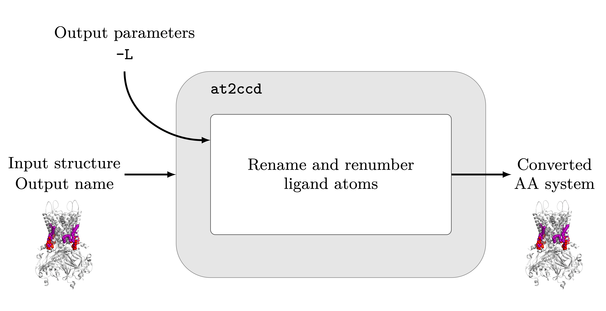

# at2ccd for converting between CHARMM and CCD codes

at2ccd can be used to convert CHARMM codes to corresponding CCD code mappings. A list of possible conversions is available [here](https://github.com/keb721/CCD2MD/blob/main/docs/ligand_table.md).

  

## Usage

> at2ccd INPUT_FILE OUTPUT_FILE [-L] 

`INPUT_FILE`  name of the file to convert -- the extension must be either .cif, .pdb or .gro

`OUTPUT_FILE` name of the converted file. This will be written as a pdb file

### Configuration file

`-CF/--configuration <config_file>` gives a configuration file which can be used to pass input parameters to at2cg. The input file and output file can be specified within the configuration file. An example configuration file can be found here](https://github.com/keb721/CCD2MD/blob/main/docs/at2cg_input.txt).

### Optional arugments -- system parameters

`-T/--title <title>` specified a title for the generated PDB output file. If not present, the default is the title of the input file (if .pdb and a title is present), otherwise the name of the input file.

`-L/--ligchain` include ligands as their own chains -- default off (binary switch)

