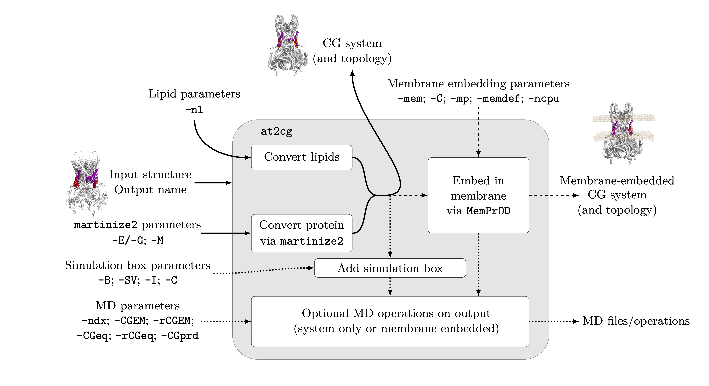

# at2cg for generating Martini file from CHARMM input

at2cg can be used to generate a Martini position file from a CHARMM input, where a mapping is possible -- optionally with a Martini 3 mapping (see [here](https://github.com/keb721/CCD2MD/blob/main/docs/ligand_table.md) for a list of all mappings available by default. Any proteins present are converted via [martinize2](https://github.com/marrink-lab/vermouth-martinize). 

Optionally, converted position files can be membrane embedded and solvated (assuming a protein/ligand system via [MemPrO](https://github.com/ShufflerBardOnTheEdge/MemPrO)/[MemPrOD[(https://github.com/ShufflerBardOnTheEdge/MemPrOD)). Thsi requires the optional dependency of MemPrOD. If desired, various MD operations (via GROMACS) may be performed; these include energy minimisation, equilibration, and generation of a production tpr file. 

The use of a configuration file is recommended, an example can be found [here](https://github.com/keb721/CCD2MD/blob/main/docs/at2cg_input.txt). The names in the configuration file correspond to the command line arguments.

A schematic for the use of at2cg is presented below. The argument -CF can optionally be used to specify the inputs. For more details, please see the full description below.

  

## Usage

> at2cg INPUT_FILE OUTPUT_FILE [-CF &lt;config_file&gt;] [-T &lt;title&gt;] [-nl] [-g &lt;gmx&gt;] [-C &lt;conc&gt;] [(-E [&lt;elastic&gt;]) | (-G &lt;go&gt;)] [-M &lt;martinize&gt;] [-mem [&lt;membrane&gt;]] [-mp &lt;mempro&gt;] [-mdef [&lt;memprod&gt;]] [-ncpu &lt;num_cpus&;] [-B [&lt;box&gt;]] [-SV [&lt;solvate&gt;]] [-I [&lt;ions&gt;]] [-ndx] [-CGEM [&lt;CGEM&gt;]] [-rCGEM [&lt;run_CGEM&gt;]] [-CGeq [&lt;CGeq&gt;]] [-rCGeq [&lt;CGeq&gt;]] [-CGprd [&lt;CGprd&gt;]]

### Required arguments

`INPUT_FILE`  name of the file to convert -- the extension must be either .cif, .pdb or .gro

`OUTPUT_FILE` name of the converted file. This will be written as a pdb file

### Configuration file

`-CF/--configuration <config_file>` gives a configuration file which can be used to pass input parameters to at2cg. The input file and output file can be specified within the configuration file. An example configuration file can be found here](https://github.com/keb721/CCD2MD/blob/main/docs/at2cg_input.txt).

### Optional arugments -- system parameters

`-T/--title <title>` specified a title for the generated PDB output file. If not present, the default is the title of the input file (if .pdb and a title is present), otherwise the name of the input file.

`-nl/--newlipidome` is a flag indicating that the new mappings for the Martini 3 lipidome (from [DOI: 10.1021/acscentsci.5c00755](https://doi.org/10.1021/acscentsci.5c00755) should be used. The new lipidome mappings available are documented [here](https://github.com/keb721/CCD2MD/blob/main/docs/ligand_table.md).

`-g/--gmx <gmx>` is a flag to give the location of a GROMACS executable. If unspecified, `gmx` will be used.

`-C/--conc <conc>` is a glad to provide the concentration of ions in the system, default = 0.15. Ions are, by default Na and Cl. For membrane embedded proteins, charge balance is maintained; specify different ions via -mem to pass to
 Insane4MemPrO. For non-membrane proteins charge balance is not maintained; specify different ions via -I.

### Optional arguments -- protein coarse-graining

`-E/--elastic [<elastic>]` specifies that protein secondary structure should be biased using an elastic network (default). Additional options for the elastic network in martinize may be added added this flag; if omitted the defaults will be used.

`-G/--go <go>` specifies that protein secondary structure should be biased using a go network. Required and optional parameters should be added after this flag.

`-M/--martinize <martinize>` is used for any additonal optional arguments which should be passed to martinize2 for protein CG conversion.

### Optional arguments -- membrane embedding 

`-mem/--membrane [<membrane>]` acts as a flag to embed the system in a membrane. Optionally, it may be followed by the arguments to be passed to Insane4MemPrO (for more information see [here](https://github.com/ShufflerBardOnTheEdge/MemPrO?tab=readme-ov-file#insane4mempro)). The most relevant parameter is the membrane composition in the form `-u POPE:7 -u POPG:2 -u CARD:1 -l POPE:7 -l POPG:2 -l CARD:1` where the numbers give the ratio of lipids, `-u` represents the upper leaflet and `-l` represents the lower leaflet. If not specified, both leaflets are pure POPC.

`-C/--conc <conc>` passes a single number giving the concentration of NaCl in the system, where the charge is balanced

`-mp/--mempro <mempro>` passes optional arguments to [MemPrO](https://github.com/ShufflerBardOnTheEdge/MemPrO). Default is 5 grid points and 15 minimisation operations 

`-mdef/--memprod [<memprod>]` is an optional flag to calculate the deformation of the membrane around the protein using[MemPrOD](https://github.com/ShufflerBardOnTheEdge/MemPrOD) -- if ommitted no deformations will be calculated. Optional arguments for MemPrOD will be passed after this flag, otherwise the MemPrOD defaults will be used.

`-ncpu/--num_cpus <num_cpus>` passes the environment variable NUM_CPUs to [MemPrO](https://github.com/ShufflerBardOnTheEdge/MemPrO). If unset, 1 CPU will be used.

### Optional arguments -- non-membrane system

`-B/--box [<box>]` creates a box for a non-membrane protein. The presence of this flag alone creates a box, solvates, and (if a non-zero concentration is specified) adds ions. After this flag, it is possible to add the arguments to be passed to gmx editconf. The default is `-c -d 2`.

`-SV/--solvate [<solvate>] solvates a box for a non-membrane protein. The presence of this flag alone creates a box, solvates, and (if a non-zero concentration is specified) adds ions. After this flag, it is possible to add the arguments to be passed to gmx solvate. The default specified a box of martini waters, and changes the radius to 0.21. Note that specifying anything after this flag removes these defaults.

`-I/--ions` adds ions for a non-membrane protein. The presence of this flag alone creates a box, solvates, and (if a non-zero concentration is specified) adds ions. After this flag, it is possible to add the arguments to be passed to gmx genion. The default is `-neutral -c {conc}` for conc specified via `-C/--conc`.

### Optional arguments -- MD simulations

`-ndx/--make_ndx` is a flag to create a GROMACS index file. This may be necessary for correct generation of equilibration/production tprs. Index file creation is currently required to be interactive.

`-CGEM/--CG_energy_minimise [<CGEM>]` generates an energy minimisation tpr for the output CG system. Additional arguments for grompp may be added after this flag. If none are added, the [default energy minimisation script](https://github.com/keb721/CCD2MD/blob/main/src/ccd2md/mdp_files/em.mdp) will be used.

`-rCGEM/--run_CG_energy_minimise [<run_CGEM>]` runs energy minimisation for the output CG system. Additional arguments for mdrun may be added after this flag.

`-CGeq/--CG_equil [<CGeq>]` generates an equilibration tpr for the output CG system. Additional arguments for grompp may be added after this flag. If none are added, the default CG equilibration script -- which depends on whether [a memvbrane is present](https://github.com/keb721/CCD2MD/blob/main/src/ccd2md/mdp_files/cg-equil-membrane.mdp) [or not](https://github.com/keb721/CCD2MD/blob/main/src/ccd2md/mdp_files/cg-equil.mdp) -- will be used.

`-rCGeq/--run_CG_equil [<run_CGeq>]` runs equilibration for the output CG system. Additional arguments for mdrun may be added after this flag.

`-CGprd/--CG_prod [<CGprd>]` generates a production tpr for the output CG system. Additional arguments for grompp may be added after this flag. If none are added, the default CG equilibration script -- which depends on whether [a membrane is present](https://github.com/keb721/CCD2MD/blob/main/src/ccd2md/mdp_files/cg-10us-membrane.mdp) [or not](https://github.com/keb721/CCD2MD/blob/main/src/ccd2md/mdp_files/cg-10us.mdp) -- will be used.

## Additional information -- MD simulations

- If a simulation box for a non-membrane embedded protein is not specified, adding MD steps will create a simulation box
- If energy minimisation, equilibration, and production are run, the output of energy minimisation will become the input for equilibration and the output of equilibration will become the input of production
- If any equilibration/production generation is initiated, energy minimisation will be performed, even in the absence of a -CGEM/-rCGEM flag. The default script and parameters will be used. The output of the energy minimisation will be used as the input to the equilibration/production
- If an equilibration file and a production file are generated, the equilibration will be run (even in the absence of -rCGeq) and used as the input
- The presence of rCGEM/-rCGeq alone will run energy minimisation/equilibration using the default parameters