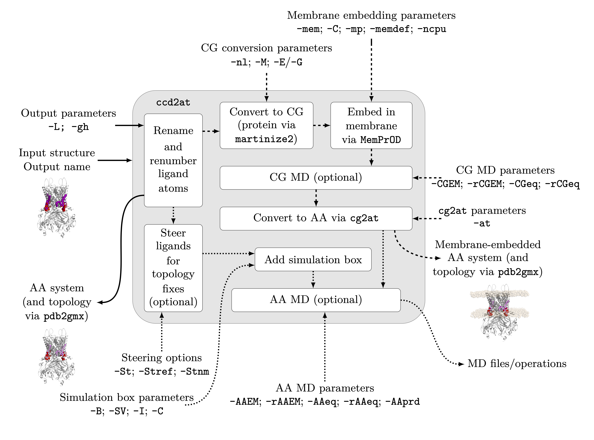

# ccd2at for conversion between CCD and CHARMM

ccd2at can be used to convert between CCD and CHARMM representations. Optionally, this output can be embedded in a membrane, within a solvated box. CCD representations include both the CCD codes listed [here](https://github.com/keb721/CCD2MD/blob/main/docs/ligand_table.md) and their corresponding userCCD mappings. Any other mappings must be manually added. 

While CCD to CHARMM conversion does not require additional packages, membrane embedding relies on intermediate coarse-graining of the system, so a CG mapping must be available (a list of the mappings included in CCD2MD by default is given [here](https://github.com/keb721/CCD2MD/blob/main/docs/ligand_table.md)). Membrane embedding requires the installation of MemPrOD (for membrane embedding) and cg2at-lite (for conversion back to an atomistic representation) -- it is recommended these are installed via
>pip install "CCD2MD[membrane]"

Any proteins present are converted via [martinize2](https://github.com/marrink-lab/vermouth-martinize). Any mappings created using the CCD2MD.cif userCCD codes can be converted as well. Membrane embedding and solvation is performed via [MemPrO](https://github.com/ShufflerBardOnTheEdge/MemPrO)/[MemPrOD[(https://github.com/ShufflerBardOnTheEdge/MemPrOD)). This requires the optional dependency of MemPrOD.

If desired, various MD operations (via GROMACS) may be performed; these include energy minimisation, equilibration, and generation of a production tpr file. These operations can be performed either on the CG system before converting back to an atomistic representation, on the final AA system, or both. Steering of the embedded ligands to perform chirality fixes is also possible.

The use of a configuration file is recommended, an example can be found [here](https://github.com/keb721/CCD2MD/blob/main/docs/ccd2at_input.txt). The names in the configuration file correspond to the command line arguments.

A schematic for the use of ccd2md is presented below. The argument -CF can optionally be used to specify the inputs. For more details, please see the full description below.

 

## Usage

> ccd2at INPUT_FILE OUTPUT_FILE [-CF &lt;config_file&gt;] [-T &lt;title&gt;] [-ndx] [-L] [-S &lt;smiles&gt; ...] [-g &lt;gmx&gt;] [-gh [&lt;gh&gt;]] [-C &lt;conc&gt;] [-M &lt;martinize&gt;] [-mem [&lt;membrane&gt;]] [-mp &lt;mempro&gt;] [-mdef &lt;memprod&gt;] [-ncpu &lt;num_cpus&;] [-at &lt;cg2at&gt;] [-ndx] [-CGEM [&lt;CGEM&gt;]] [-rCGEM [&lt;run_CGEM&gt;]] [-CGeq [&lt;CGeq&gt;]] [-rCGeq [&lt;CGeq&gt;]] [-nl] [(-E [&lt;elastic&gt;]) | (-G &lt;go&gt;)] [-M &lt;martinize&gt;] [-B [&lt;box&gt;]] [-SV [&lt;solvate&gt;]] [-I [&lt;ions&gt;]] [-AAEM [&lt;AAEM&gt;]] [-rAAEM [&lt;run_AAEM&gt;]] [-AAeq [&lt;AAeq&gt;]] [-rAAeq [&lt;AAeq&gt;]] [-AAprd [&lt;AAprd&gt;]] [-St] [-Stnm &lt;stnm&gt; ...] [-Stref &lt;stref&gt; ...] 

### Required arguments

`INPUT_FILE`  name of the file to convert -- the extension must be either .cif, .pdb or .gro

`OUTPUT_FILE` name of the converted file. This will be written as a pdb file

### Configuration file

`-CF/--configuration <config_file>` gives a configuration file which can be used to pass input parameters to at2cg. The input file and output file can be specified within the configuration file. An example configuration file can be found here](https://github.com/keb721/CCD2MD/blob/main/docs/ccd2cg_input.txt).

### Optional arugments -- system parameters

`-T/--title <title>` specified a title for the generated PDB output file. If not present, the default is the title of the input file (if .pdb and a title is present), otherwise the name of the input file.

`-ndx/--make_ndx` is a flag to create a GROMACS index file. This may be necessary for correct generation of equilibration/production tprs. Index file creation is currently required to be interactive. If CG MD is performed, this will create an index file before CG MD and after conversion back to atomistic

`-L/--ligchain` include ligands as their own chains -- default off (binary switch)

`-S/--SMILES <smiles> ... ` specifies the name of the SMILES mapping(s) to use (should be added to the database as described in the [CCD2MD paper](https://pubs.acs.org/doi/full/10.1021/acs.jcim.5c02066)). This must specify the number of mappings used, and their order. For multiple of the same ligand, this can be written "POES POES" or "POES 2".

`-g/--gmx <gmx>` is a flag to give the location of a GROMACS executable -- this will also be passed to cg2at. If unspecified, 'gmx' will be used.

`-gh/--pdb2gmx [<gh>]`  overrides ALL defaults of pdb2gmx and optionally can be used pass extra arguments. This may require interactivity, and may be necessary for a starting MET. Default is topology in topol.top, OUTPUTNAME_H.pdb, TIP3P water, charmm36-ccd2md forcefield, and charged termini (excepting starting CYST or GLYM which are set to None). Only applicable if NOT embedding the system in a membrane. Please note that for interactive histidine selection, this must be specified via the configuration file.

`-C/--conc <conc>` is a glad to provide the concentration of ions in the system, default = 0.15. Ions are, by default Na and Cl. For membrane embedded proteins, charge balance is maintained; specify different ions via -mem to pass to
 Insane4MemPrO. For non-membrane proteins charge balance is not maintained; specify different ions via -I.

### Optional arguments -- membrane embedding 

`-mem/--membrane [<membrane>]` acts as a flag to embed the system in a membrane. Optionally, it may be followed by the arguments to be passed to Insane4MemPrO (for more information see [here](https://github.com/ShufflerBardOnTheEdge/MemPrO?tab=readme-ov-file#insane4mempro)). The most relevant parameter is the membrane composition in the form `-u POPE:7 -u POPG:2 -u CARD:1 -l POPE:7 -l POPG:2 -l CARD:1` where the numbers give the ratio of lipids, `-u` represents the upper leaflet and `-l` represents the lower leaflet. If not specified, both leaflets are pure POPC.

`-mp/--mempro <mempro>` passes optional arguments to [MemPrO](https://github.com/ShufflerBardOnTheEdge/MemPrO). Default is 5 grid points and 15 minimisation operations 

`-mdef/--memprod <memprod>` is an optional flag to calculate the deformation of the membrane around the protein using[MemPrOD](https://github.com/ShufflerBardOnTheEdge/MemPrOD) -- if ommitted no deformations will be calculated. Optional arguments for MemPrOD will be passed after this flag, otherwise the MemPrOD defaults will be used.

`-ncpu/--num_cpus <num_cpus>` passes the environment variable NUM_CPUs to [MemPrO](https://github.com/ShufflerBardOnTheEdge/MemPrO). If unset, 1 CPU will be used.

`-at/--cg2at <cg2at>` passes additional arguments to CG2AT-lite. Add additional arguments after this flag -- note that this may require interactivity as it may remove assumptions about fragment locations. The GROMACS version cannot be specified separately for ccd2at and CG2AT-lite  -- -g/--gmx counts as a ccd2at flag.

### Optional arguments -- CG MD simulations

`-CGEM/--CG_energy_minimise [<CGEM>]` generates/runs an energy minimisation tpr for the intermediate CG system. Additional arguments for grompp may be added after this flag. If none are added, the [default energy minimisation script](https://github.com/keb721/CCD2MD/blob/main/src/ccd2md/mdp_files/em.mdp) will be used.

`-rCGEM/--run_CG_energy_minimise [<CGEM>]` runs energy minimisation for the intermediate CG system. Additional arguments for mdrun may be added after this flag.

`-CGeq/--CG_equil [<CGeq>]` generates/runs an equilibration tpr for the intermediate CG system. Additional arguments for grompp may be added after this flag. If none are added, the default CG equilibration script -- which depends on whether [a memvbrane is present](https://github.com/keb721/CCD2MD/blob/main/src/ccd2md/mdp_files/cg-equil-membrane.mdp) [or not](https://github.com/keb721/CCD2MD/blob/main/src/ccd2md/mdp_files/cg-equil.mdp) -- will be used.

`-rCGeq/--run_CG_equil [<rCGeq>]` runs equilibration for the output CG system. Additional arguments for mdrun may be added after this flag.

#### CG conversion options -- only relevant where CG MD performed

`-nl/--newlipidome` is a flag indicating that the new mappings for the Martini 3 lipidome (from [DOI: 10.1021/acscentsci.5c00755](https://doi.org/10.1021/acscentsci.5c00755) should be used. The new lipidome mappings available are documented [here](https://github.com/keb721/CCD2MD/blob/main/docs/ligand_table.md).

`-E/--elastic [<elastic>]` specifies that protein secondary structure should be biased using an elastic network (default). Additional options for the elastic network in martinize may be added added this flag; if omitted the defaults will be used.

`-G/--go <go>` specifies that protein secondary structure should be biased using a go network. Required and optional parameters should be added after this flag.

`-M/--martinize <martinize>` is used for any additonal optional arguments which should be passed to martinize2 for protein CG conversion.

### Optional arguments -- non-membrane system

`-B/--box [<box>]` creates a box for a non-membrane protein. The presence of this flag alone creates a box, solvates, and (if a non-zero concentration is specified) adds ions. After this flag, it is possible to add the arguments to be passed to gmx editconf. The default is `-c -d 2`.

`-SV/--solvate [<solvate>] solvates a box for a non-membrane protein. The presence of this flag alone creates a box, solvates, and (if a non-zero concentration is specified) adds ions. After this flag, it is possible to add the arguments to be passed to gmx solvate.

`-I/--ions` adds ions for a non-membrane protein. The presence of this flag alone creates a box, solvates, and (if a non-zero concentration is specified) adds ions. After this flag, it is possible to add the arguments to be passed to gmx genion. The default is `-neutral -c {conc}` for conc specified via `-C/--conc`.

### Optional arguments -- AA MD simulations

`-AAEM/--AA_energy_minimise [<AAEM>]` generates an energy minimisation tpr for the output AA system. Additional arguments for grompp may be added after this flag. If none are added, the [default energy minimisation script](https://github.com/keb721/CCD2MD/blob/main/src/ccd2md/mdp_files/em.mdp) will be used.

`-rAAEM/--run_AA_energy_minimise [<run_AAEM>]` runs energy minimisation for the output AA system. Additional arguments for mdrun may be added after this flag.

`-AAeq/--AA_equil [<AAeq>]` generates an equilibration tpr for the output AA system. Additional arguments for grompp may be added after this flag. If none are added, the default AA equilibration script -- which depends on whether [a memvbrane is present](https://github.com/keb721/CCD2MD/blob/main/src/ccd2md/mdp_files/10ns-pr-membrane.mdp) [or not](https://github.com/keb721/CCD2MD/blob/main/src/ccd2md/mdp_files/10ns-pr.mdp) -- will be used.

`-rAAeq/--run_AA_equil [<run_AAeq>]` runs equilibration for the output AA system. Additional arguments for mdrun may be added after this flag.

`-AAprd/--AA_prod [<AAprd>]` generates a production tpr for the output AA system. Additional arguments for grompp may be added after this flag. If none are added, the default AA equilibration script -- which depends on whether [a membrane is present](https://github.com/keb721/CCD2MD/blob/main/src/ccd2md/mdp_files/500ns-membrane.mdp) [or not](https://github.com/keb721/CCD2MD/blob/main/src/ccd2md/mdp_files/500ns.mdp) -- will be used.

### Optional arguments -- steering

`-St/--steer` runs steering

`-Stnm/--steer_name <ligand> ...` specifies the names of the ligands for which steering should be performed. Note that this only applies to ligands in the original prediction (i.e., any instances within the membrane will be ignored). The presence of this flag alone will run steering.

`-Stref/--steer_ref <reference> ...` specifies files for which reference positions of ligands can be found (gro/pdb/cif). If a ligand is not present in provided reference files (or no reference files are provided), reference positions are extracted from CCD2MD.cif. The presence of this flag alone will run steering.

## Additional information -- MD simulations

### Intermediate (CG) MD (membrane-embedded systems only)

- If energy minimisation and equilibration are run, the output of energy minimisation will become the input for equilibration and the output of equilibration will be converted back to atomistic
- For energy minimisation alone, the output of this will be converted back to atomistic
- If any equilibration generation is initiated, energy minimisation will be performed, even in the absence of a -CGEM/-rCGEM flag. The default script and parameters will be used. The output of the energy minimisation will be used as the input to the equilibration
- Generation of an energy minimisation file will run energy minimisation
- Generation of an equilibration file will run equilibration
- The presence of rCGEM/-rCGeq alone will run energy minimisation/equilibration using the default parameters

### Final (AA) MD

- If a simulation box for a non-membrane embedded protein is not specified, adding MD steps will create a simulation box
- If energy minimisation, equilibration, and production are run, the output of energy minimisation will become the innput for equilibration and the output of equilibration will become the input of production
- If any equilibration/production generation is initiated, energy minimisation will be performed, even in the absence of a -AAEM/-rAAEM flag. The default script and parameters will be used. The output of the energy minimisation will be used as the input to the equilibration/production
- If an equilibration file and a production file are generated, the equilibration will be run (even in the absence of -rAAeq) and used as the input
- The presence of rAAEM/-rAAeq alone will run energy minimisation/equilibration using the default parameters