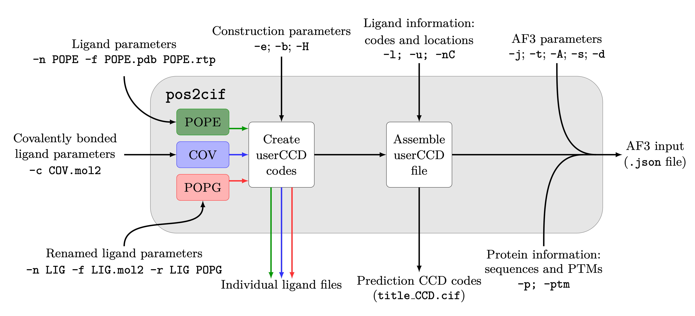

# pos2cif for generating AF3 input files

pos2cif can be used to generate input files for AF3, with and without generating userCCD codes. When the atomic naming and orderings match that of the desired forcefield then no additional post-processing is required. Modified amino acids can also be input and the resulting CCD code manually added as a PTM for the correct location in the protein. Ligands composed of chains of multiple residues can be added, although the quality of the joins may be variable. For more information on userCCD codes see the AF3 docs [here](https://github.com/google-deepmind/alphafold3/blob/main/docs/input.md#user-provided-ccd). There are no optional dependencies for pos2cif.

The use of a configuration file is recommended -- an example can be found [here](https://github.com/keb721/CCD2MD/blob/main/docs/pos2cif_input.txt). The names in the configuration file correspond to the command line arguments.

A schematic for the use of pos2cif is presented below. The arguments -CF and -ncl can optionally be used to specify the inputs. For more details, please see the full description below. 

  

> pos2cif [-CF &lt;config_file&gt;] [-ncl] [-n &lt;ligand&gt; ... -f &lt;files&gt; ...] [-r (&lt;old&gt; &lt;new&gt;) ...] [-c ((&lt;pdb&gt; &lt;itp&gt;) | &lt;mol2&gt;) ...] [-e &lt;charge&gt;] [-b &lt;bond&gt;] [-H] [-p (&lt;protein&gt; | (&lt;protein N &gt;)) ...] [-ptm (&lt;chain resID CCD &gt;) ...] [-l (&lt;ligand&gt; | (&lt;ligand N &gt;)) ...] [-u &lt;userCCDfile&gt; ...] [-nC] [-j &lt;json&gt;] [-t &lt;title&gt;] [-A &lt;afvers&gt;] [-s &lt;seed&gt; ...] [-d &lt;dialect&gt;] 

# Specifying inputs
`-CF/--configuration <config_file>` gives a configuration file to read - see an example [here](https://github.com/keb721/CCD2MD/blob/main/docs/pos2cif_input.txt)

`-ncl/--no_command_line` is a flag to ignore all command line information other than that giving the configuration file. This can be used to prevent changes to presets given in the cionfiguration files. In general, this will throw an error, but additional proteins and ligands can be added via the command line.

## CCD code creation information

`-n/--names <ligand> ...` gives the names of the ligands to extract from files and produce cif files for

`-f/--files <files> ...` gives the name of position (required) and bonding (optional) files for the ligands to be converted. Position files may be .pdb, .crd, .gro, or .mol2 with additional bonding information provided by .rtp, .rtf, or .itp files. Position files may contain information for several ligands, but should only include one copy of the ligand of interest.

`-r/--rename (<old> <new>) ...` allows ligands to have a different userCCD name than in the original file. For each ligand to be renamed, `old` is the name in the position file, and `new` is the desired output name. When using the output of this in the prediction, use the new name.

`-c/--covalent ((<pdb> <itp>) | <mol2>) ...` gives either a .pdb and .itp file (note, that this must follow the .pdb then .itp order) or a .mol2 file for every covalently bonded ligand to be added to the system. Note that in contrast to the files for single component ligands, these files should include information for the covalently bonded ligand only.

## Optional arguments/cutoffs for CCD creation

`-e/--charge <charge>` is an optional cutoff for increments of the integer charge in the cif files. For each partial integer charge above the cutoff the integer charge output will be changed by 1. The default is 0.75 $e$.

`-b/--bond <bond>` is an optional cutoff for generating bonding information from positional information -- note that this is not utilised where bonding information is given in a bonding file. If the distance between two atoms is less than the cutoff, a bond between these atoms is output. The default is 1.4 \AA.

`-H/--Hydrogens` is a flag to output hydrogen position and bonding information.

## System information

`-p/--protein (<protein> | (<protein> <N>)) ...` allows input of FASTA protein sequence(s) for the json file. Sequences can be put in in FASTA form or in a FASTA file, numbers can be inserted to detail how many of the sequence should be added. FASTA files can contain multple sequences but each sequence must be preceeded by a protein information line starting with ">". A mixture of sequences and FASTA files may be used, a FASTA file followed by a number will input N copies of all sequences within the file. Proteins can be specified on the command line in addition to the configuration file.

`-ptm/--post_trans_mod (<chain resID CCD>) ...`  adds post-translational modifications in the style `A 12 LYSM` (i.e., chain identifier,  residue ID position of PTM on chain, CCD code for specified PTM). Protein chains are labelled in alphabetical order starting from A, residue IDs start from 1, and CCD codes may be conventional or userCCD. PTMs can bespecified on the command line in addition to the configuration file.

`-l/--ligand (<ligand> | (<ligand> <N>)) ...` adds ligands to json file in CCD format. Numbers can be inserted to detail how many of the CCD code should be added. If no ligands are explicitly added, one copy of every ligand for which a userCCD code is created (see [below](https://github.com/keb721/CCD2MD/blob/main/docs/pos2cif_docs.md#cif-generation)) is added. Ligands can be specified on the command line in addition to the configuration file. Please note, that for non-default addition of renamed lipids the new name must be used.

`-u/--userCCDPath <userCCDfile> ...` gives the path to files containing userCCD information, from which relevant information for userCCD codes added via the `-l` flag can be read. All relevant userCCD information for the specified system (from converted ligands, ligands present in files added via this flag, and ligands in CCD2MD.cif) are added to {title}_CCD.cif. Specified files may contain userCCD information for mutltiple ligands, or a single covalently bonded ligand. If a single covalently bound ligand is expected, this must take the form of a userCCD field and a following bondedAtomPairs field - files produced by pos2cif follow this required format. UserCCDfiles can be specified on the command line in addition to the configuration file.

`-nC/--no_CCD2MD` is a flag for whether CCD2MD.cif should be scanned for CCD codes for ligands.

## AF3 information

`-j/--json <json>` gives the option to change the name of the json file containing the required userCCD field for AlphaFold3 inputs (default output.json). For each ligand, an additional file containing the cif data is output to NAME_output.cif

`-t/--title <title>` gives the name of the system to be passed to the output json file. The default is pos2cif_system. All relevant userCCD codes are added to {title}_CCD.cif.

`-A/--afvers <version>` gives the version number to be output in the json file. The default is 3.

`-s/--seeds <model seed> ...` gives the model seeds to pass to AF3 - these need not be comma separated. The default seed is 1.

`-d/--dialect <dialect>` gives the dialect to be output in the json file. The default is alphafold3.
